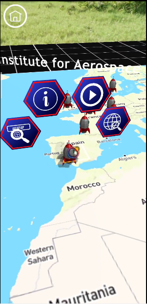
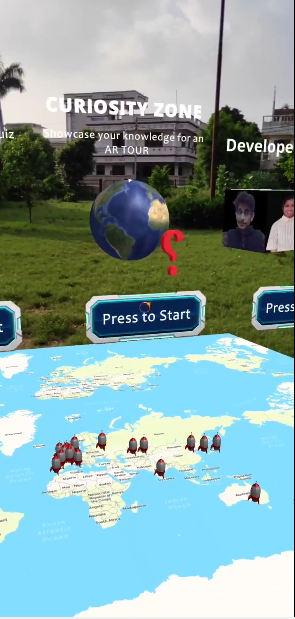
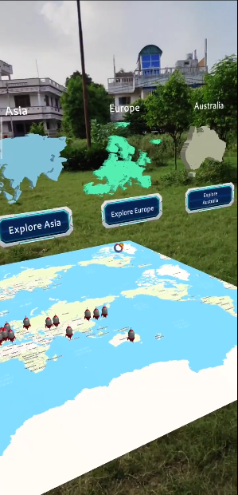
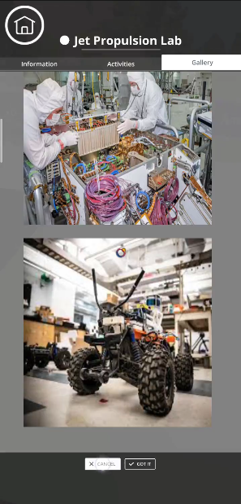
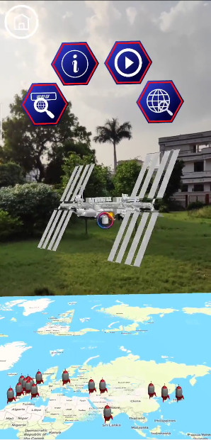
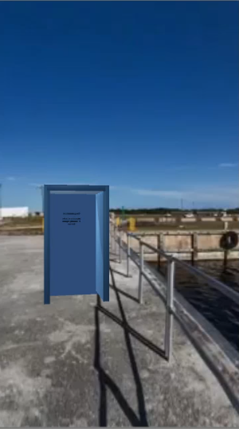
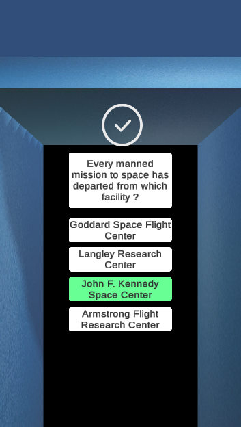

# Astro BackyARd
Astro BackyAR is educational AR based space exploring solution to augment your reality and take you to explore the breadth of the space sector's influence in your own backyard.

**Youtube Video:** 
**Presentation:** 

### Features:
- No More Boring 2D Maps, Astro BackyARd augment the reality with 3D Maps.

-----------------------------------------------------------
- Get connected with the updates of Space Exploration Work done by different organizations, government agencies and other communities of all the continents.
--------------------------------------------------------------------

- Keep you aware with Historical Activites and Work of Space Organizations and Communities, Displays comprehensive information of all the past missions, present project and future planninngs of the Organizations.
--------------------------------------------------------------

- Enable user to jump from one location to another just by gazing on the screen.
-----------------------------------------------------------------------------

- Serves as Educational tool by enabling user to play a quiz game about all the loactions.
-------------------------------------------------------------------------

- User can teleport to the specific location by solving the Quiz.
------------------------------------------------------------------------------

- Gives User an AR Tour of the organization.
-----------------------------------------------------------------------------

- Important Links and News Portals to keep the user updated current activities of those organizations
----------------------------------------------------------------------------------

## Glimpses:
--------------

## NASA Resources:
-------------------
1. [NASA History](https://history.nasa.gov/) - To collect data of historical activities of NASA.
2. [NASA Partnership](https://www.nasa.gov/partnerships.html) - To collect information regarding NASA's Partnership and Agreements with other Organizations and Communities.
3. [NASA 3D Resources](https://github.com/nasa/NASA-3D-Resources) - To access NASA 3D Model Gallery of different Space Exploration Missions.
4. [NASA Research Announcements](https://www.nasa.gov/ames/partnerships/spaceportal/nra) - To collect Information about International Space Station, for the space section of our Solution.
